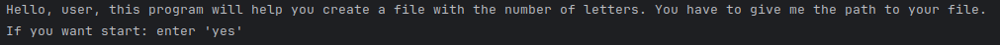
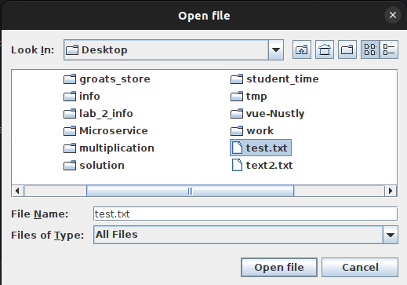
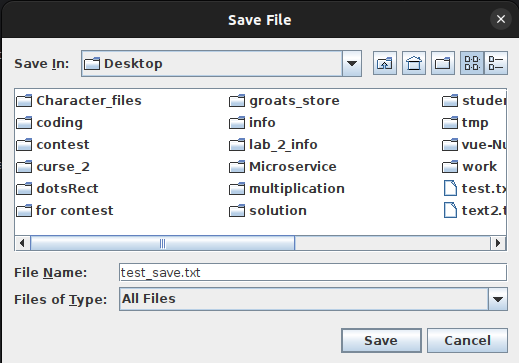

1. Для начала программа попросит ввести 'yes' для старта

2. Дальше появиться окно, через которое нужно выбрать файл

3. После выбор файла, появиться следующее окно для места сохронения файла

---

В папке tmp прилогается тестовый экземпляр.